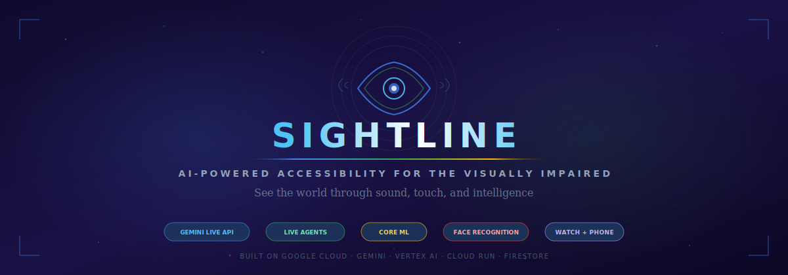
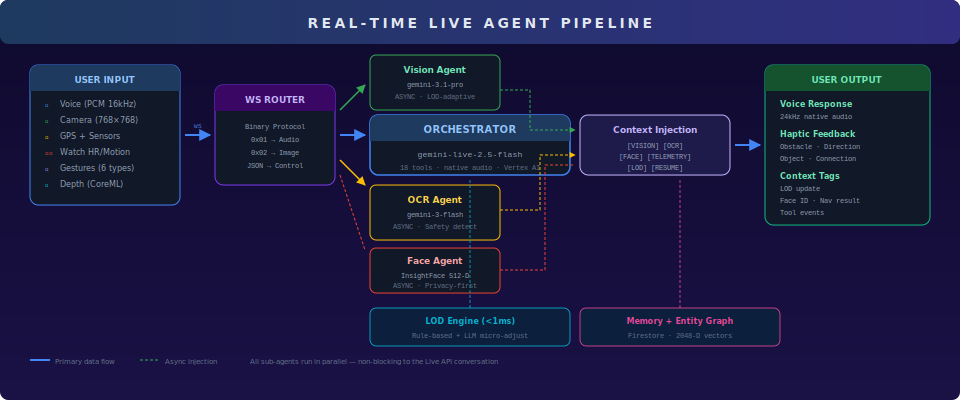
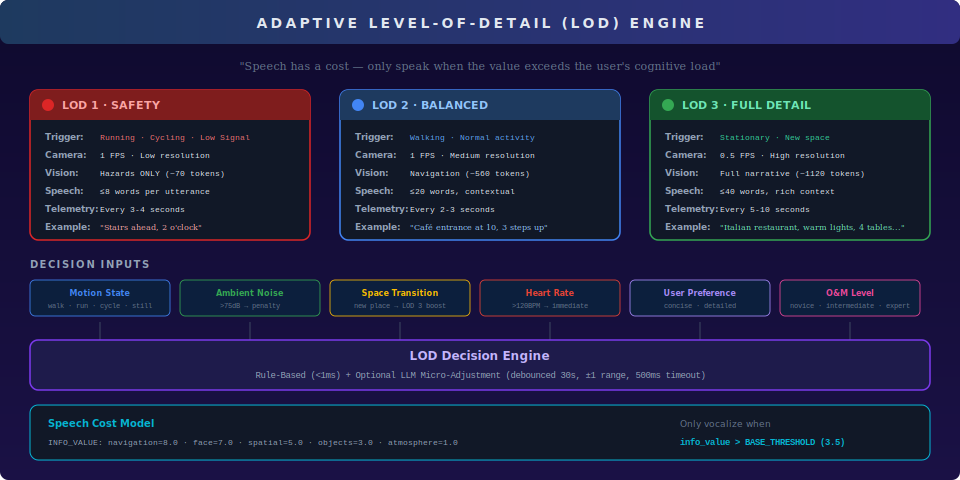
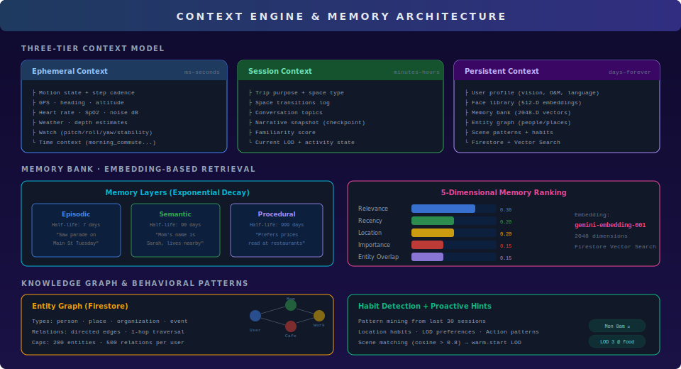
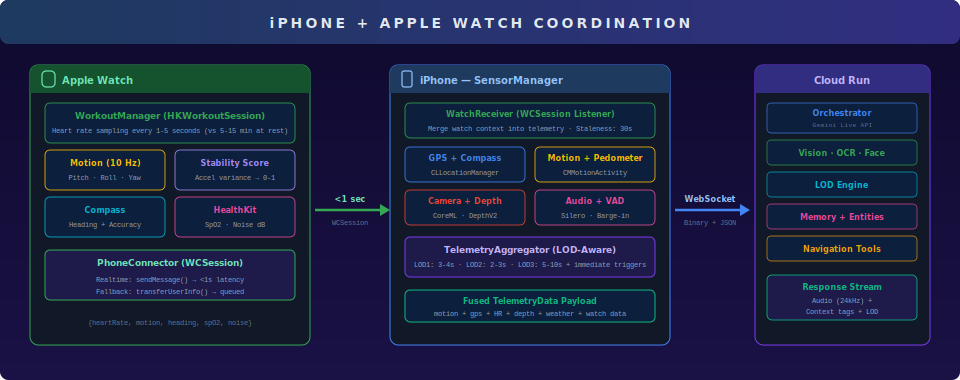

<div align="center">

</div>

<div align="center">

[](https://cloud.google.com/)
[](https://ai.google.dev/)
[](https://google.github.io/adk-docs/)

[](https://python.org)
[](https://swift.org)
[](https://fastapi.tiangolo.com)
[](https://cloud.google.com/run)
[](https://firebase.google.com/docs/firestore)
[](LICENSE)

**[Architecture](#system-architecture)** · **[Features](#features)** · **[How It Works](#how-it-works)** · **[Live Agent Pipeline](#live-agent-pipeline)** · **[LOD Engine](#adaptive-lod-engine)** · **[Quick Start](#quick-start)** · **[Testing](#reproducible-testing-instructions)**

</div>

---

## What is SightLine?

**SightLine** is a real-time AI accessibility platform that transforms how blind and visually impaired people navigate the world. It combines **Gemini Live API** with multi-agent orchestration, on-device ML, Apple Watch biometrics, and 18 function-calling tools to deliver contextual, conversational assistance through sound and touch.

> *"See the world through sound, touch, and intelligence."*

Unlike traditional screen readers or navigation apps, SightLine **understands context**. It knows when you're walking fast and keeps alerts brief. It recognizes your mom's face and greets her by name. It remembers you prefer prices read aloud at restaurants. It adapts — continuously, silently, intelligently.

### The Core Innovation

| | |
|---|---|
| **Adaptive Intelligence** | A 3-tier Level-of-Detail engine that quantifies "speech cost" — only speaking when information value exceeds cognitive load |
| **Multi-Agent Parallelism** | Vision, OCR, and face recognition agents run asynchronously alongside the Live API orchestrator — zero blocking |
| **Persistent Memory** | Embedding-based memory with exponential decay, entity graphs, and habit detection across sessions |

---

## Features

| Feature | Description | Tech |
|---------|------------|------|
| **Gemini Live Agent** | Real-time conversational AI with native audio I/O and 18 function-calling tools | Gemini Live API · Vertex AI · Google ADK |
| **Multi-Agent System** | Parallel vision, OCR, and face agents inject context into the live conversation | gemini-3.1-pro · gemini-3-flash · InsightFace |
| **Adaptive LOD Engine** | Rule-based (<1ms) + LLM micro-adjustment for speech detail based on motion, noise, heart rate | Custom decision engine + speech cost model |
| **On-Device ML** | Monocular depth estimation and voice activity detection running locally | Depth Anything V2 (CoreML) · Silero VAD (ONNX) |
| **iPhone + Watch Fusion** | Real-time heart rate, motion attitude, stability score, SpO2 via WatchConnectivity | watchOS · HKWorkoutSession · WCSession |
| **Face Recognition** | Privacy-first face identification using 512-D ArcFace embeddings — no raw images stored | InsightFace · Firestore Vector Search |
| **Gesture Control** | 6 distinct multi-touch gestures for fully eyes-free operation | SwiftUI · Core Haptics · VoiceOver |
| **Haptic Language** | Directional cues, obstacle proximity, object textures encoded as tactile patterns | Core Haptics · AHAP patterns |
| **Persistent Memory** | 3-layer memory bank with exponential decay + semantic entity graph | gemini-embedding-001 (2048-D) · Firestore |
| **Navigation Intelligence** | Walking directions with slope warnings, clock-position bearings, accessibility info | Routes API v2 · Elevation · OpenStreetMap |
| **Context Engine** | 3-tier context model (ephemeral/session/persistent) with habit detection and scene matching | Custom architecture · Firestore |
| **Binary WebSocket Protocol** | Magic-byte frames eliminate ~33% Base64 overhead on audio/video streams | NWConnection · Custom protocol |
| **Session Continuity** | Gemini session resumption handles + Firestore memory for cross-session persistence | session_resumption_handle · UserDefaults |
| **Graceful Degradation** | Automatic safe mode on disconnect with local TTS, exponential backoff reconnect | AVSpeechSynthesizer · NWPathMonitor |
| **Smart Frame Selection** | Pixel-diff deduplication skips static scenes, force-sends every 5s safety valve | 32×32 thumbnail MAD comparison |
| **Barge-In Detection** | Sophisticated echo suppression combining RMS + VAD + guard windows | Hardware AEC · Silero VAD · 600ms confirmation |
| **Narrative Checkpointing** | Saves reading progress (e.g., menu items) when LOD drops, resumes on upgrade | 10-min TTL · [RESUME] injection |
| **Tool Behavior Modes** | INTERRUPT / WHEN_IDLE / SILENT control when agent results are vocalized | Custom policy per tool type |

---

## System Architecture

<div align="center">

</div>

### Stack Overview

| Layer | Technology | Purpose |
|-------|-----------|---------|
| **iOS App** | SwiftUI · UIKit · AVFoundation · CoreML · ONNX Runtime | Camera, audio, sensors, depth estimation, gestures, haptics |
| **watchOS** | HealthKit · CoreMotion · WatchConnectivity | Heart rate, motion attitude, stability, SpO2, noise |
| **Backend** | Python 3.12 · FastAPI · Google ADK 1.25.1 | Agent orchestration, tool execution, context management |
| **Live API** | Gemini Live 2.5 Flash (Vertex AI) | Real-time voice conversation with native audio |
| **Vision** | Gemini 3.1 Pro Preview | Async scene analysis with LOD-adaptive detail |
| **OCR** | Gemini 3 Flash Preview | Text extraction + safety sign detection |
| **Embeddings** | gemini-embedding-001 | 2048-D vectors for memory + entity search |
| **Face Recognition** | InsightFace (ArcFace buffalo_l) | 512-D face embeddings, cosine similarity matching |
| **Database** | Firestore (Native mode) | User profiles, face library, memories, entity graph |
| **Vector Search** | Firestore Vector Index | 512-D face search + 2048-D memory retrieval |
| **Maps** | Routes v2 · Places · Elevation · Geocoding · Street View | Navigation, POI discovery, slope warnings |
| **Accessibility** | OpenStreetMap Overpass API | Tactile paving, wheelchair ramps, audio signals |
| **Infrastructure** | Cloud Run · Secret Manager · Artifact Registry | Deployment, secrets, CI/CD |

---

## How It Works

<div align="center">

</div>

### The Pipeline

1. **User speaks** — PCM 16kHz audio captured with hardware echo cancellation, processed through Silero VAD
2. **Camera captures** — JPEG 768×768 at LOD-controlled FPS, with pixel-diff deduplication
3. **Watch monitors** — Heart rate (1-5s), 6-DOF motion (10 Hz), stability score, SpO2
4. **Telemetry fuses** — All sensor data aggregated and throttled by LOD level
5. **Binary WebSocket** — Audio (0x01), images (0x02), JSON control sent to Cloud Run backend
6. **Agents process in parallel**:
   - **Orchestrator**: Real-time voice conversation via Gemini Live API with 18 tools
   - **Vision Agent**: Async scene analysis at LOD-appropriate detail (70→560→1120 tokens)
   - **OCR Agent**: Text extraction and safety sign detection
   - **Face Agent**: InsightFace 512-D embedding match against Firestore library
7. **Context injection** — Agent results injected as `[VISION]`, `[OCR]`, `[FACE ID]`, `[TELEMETRY]` tags into the live conversation
8. **Response streams back** — 24kHz native audio + haptic cues + context updates

---

## Live Agent Pipeline

### Orchestrator Agent

The orchestrator is the heart of SightLine — a Gemini Live API agent with **18 function-calling tools** and a 226-line system prompt built around accessibility-first principles:

- **Silence by Default** — Only speak when genuinely useful
- **Clock Positions** — All directions relative to user heading (e.g., "café at 2 o'clock")
- **Adaptive Detail** — Strict word limits per LOD level (8 / 20 / 40 words)
- **Never Echo Context** — Internal tags `[VISION]`, `[FACE ID]` never vocalized

### 18 Function-Calling Tools

| Category | Tools |
|----------|-------|
| **Navigation** | `navigate_to` · `get_walking_directions` · `preview_destination` |
| **Location** | `get_location_info` · `reverse_geocode` · `resolve_plus_code` · `convert_to_plus_code` |
| **Discovery** | `nearby_search` · `google_search` · `maps_query` · `validate_address` |
| **Accessibility** | `get_accessibility_info` (OpenStreetMap tactile paving, ramps, crossings) |
| **Vision** | `extract_text_from_camera` (triggers OCR agent) |
| **Memory** | `preload_memory` · `remember_entity` · `what_do_you_remember` · `forget_entity` · `forget_recent_memory` |

### Multi-Agent Parallelism

All sub-agents run **asynchronously** — they never block the live voice conversation:

```
Orchestrator ←──── LiveRequestQueue ←──── [VISION ANALYSIS]  (gemini-3.1-pro)
     ↑                    ↑
     │                    ├──── [OCR RESULT]        (gemini-3-flash)
     │                    ├──── [FACE ID]           (InsightFace)
     │                    ├──── [TELEMETRY UPDATE]  (sensor fusion)
     │                    └──── [LOD UPDATE]        (decision engine)
     │
     └── 18 tools (navigation, search, memory, accessibility...)
```

### Tool Behavior Modes

| Mode | When Used | Effect |
|------|-----------|--------|
| **INTERRUPT** | Safety-critical navigation alerts | Stop playback, deliver immediately |
| **WHEN_IDLE** | Vision descriptions, search results | Queue until agent stops speaking |
| **SILENT** | Face identification, context updates | Inject without forcing speech |

---

## Adaptive LOD Engine

<div align="center">

</div>

### Speech Cost Model

SightLine treats speech as a scarce resource with measurable cost:

```python
INFO_VALUES = {
    "navigation": 8.0,        # always worth saying
    "face_recognition": 7.0,  # important for social context
    "spatial_description": 5.0,
    "object_enumeration": 3.0,
    "atmosphere": 1.0,        # only at LOD 3
}
BASE_SPEECH_THRESHOLD = 3.5   # must exceed to vocalize
```

### Decision Inputs

| Input | Source | Impact |
|-------|--------|--------|
| Motion state | CMMotionActivity | walk→LOD 2, run→LOD 1, still→LOD 3 |
| Ambient noise | NoiseMeter (25th percentile) | >75dB → LOD penalty |
| Space transition | GPS accuracy shift | New space → temporary LOD 3 |
| Heart rate | Watch (1-5s) | >120 BPM or >30% spike → immediate trigger |
| User preference | Profile | "concise" vs "detailed" |
| O&M level | Profile | novice→LOD 3, expert→LOD 1 |
| Gesture override | Swipe up/down | Manual ±1 adjustment |

### Dual-Layer Decision

1. **Rule-based engine** (<1ms): Deterministic LOD from sensor fusion
2. **LLM micro-adjustment** (optional): gemini-3-flash evaluates context for ±1 refinement, debounced to 30s, 500ms hard timeout

---

## Context Engine & Memory

<div align="center">

</div>

### Three-Tier Context Model

| Tier | Lifetime | Contents |
|------|----------|----------|
| **Ephemeral** | ms–seconds | Motion, GPS, heading, HR, SpO2, noise, weather, depth, watch attitude |
| **Session** | minutes–hours | Trip purpose, space transitions, conversation topics, narrative checkpoints |
| **Persistent** | days–forever | User profile, face library, memories, entity graph, scene patterns |

### Memory Bank

- **Embedding model**: `gemini-embedding-001` (2048 dimensions)
- **Storage**: Firestore with native vector search
- **Three memory layers** with exponential decay:
  - **Episodic** (7-day half-life): "Saw a parade on Main St last Tuesday"
  - **Semantic** (90-day half-life): "Mom's name is Sarah, lives nearby"
  - **Procedural** (999-day half-life): "Prefers prices read at restaurants"
- **5-dimensional ranking**: Relevance (0.30) + Recency (0.20) + Location (0.20) + Importance (0.15) + Entity Overlap (0.15)
- **Conflict detection**: Cosine similarity >0.8 triggers automatic merge

### Entity Graph

A Firestore-backed knowledge graph with person/place/organization/event nodes, directed relations, and 1-hop traversal. Capped at 200 entities and 500 relations per user.

### Habit Detection

Pattern mining across 30 sessions to detect location habits ("visits Starbucks Monday mornings"), LOD preferences ("always LOD 3 at restaurants"), and action patterns ("always wants prices read at food places"). Used for warm-start LOD and proactive hints.

---

## iPhone + Apple Watch Coordination

<div align="center">

</div>

### Watch Capabilities

| Sensor | Frequency | Data |
|--------|-----------|------|
| Heart Rate | 1-5s (via HKWorkoutSession) | BPM — triggers LOD change on spike |
| Device Motion | 10 Hz | Pitch, roll, yaw — body orientation |
| Stability Score | Computed | Acceleration variance → 0-1 stability metric |
| Compass | Continuous | Magnetic heading + accuracy |
| SpO2 | System-measured | Blood oxygen percentage |
| Noise Exposure | HealthKit | Environmental audio dB |

### Delivery Protocol

- **Real-time path**: `WCSession.sendMessage()` when iPhone reachable (<1s latency)
- **Fallback path**: `WCSession.transferUserInfo()` when unreachable (queued delivery)
- **Staleness detection**: Heart rate only considered "fresh" within 30s window

---

## On-Device ML

### Depth Anything V2 (CoreML)

- **Model**: `DepthAnythingV2SmallF16.mlmodelc` — monocular depth estimation
- **Inference**: Neural Engine preferred, Vision framework pipeline
- **Output**: 5-region depth summary (center + 4 quadrants) in approximate meters
- **Use**: Obstacle proximity alerts, spatial awareness enrichment in telemetry

### Silero VAD v4 (ONNX)

- **Model**: Silero Voice Activity Detection running on ONNX Runtime
- **Input**: 512 samples @ 16kHz (32ms windows) with LSTM state (256 floats)
- **Debounce**: 2-frame onset (64ms), 8-frame offset (256ms)
- **Use**: Barge-in confirmation — prevents model's own echo from triggering interrupts

### Barge-In Detection

Sophisticated echo suppression combining hardware AEC, RMS thresholding, and VAD:

```
IF model speaking AND within 150ms guard window:
  Track consecutive high-RMS guard windows
  IF 3+ consecutive → echo artifact → SUPPRESS
ELSE IF model speaking:
  Check RMS > 0.12 (residual echo < 0.02)
  Check VAD ≥ 0.75
  Require 6 consecutive frames (600ms)
  → REAL barge-in → interrupt playback
```

---

## Gesture & Haptic Interface

### 6 Gesture Vocabulary

| Gesture | Action | Haptic |
|---------|--------|--------|
| **Single Tap** | Toggle mute | Light impact |
| **Double Tap** | Interrupt agent (barge-in) | 2× medium impact |
| **Triple Tap** | Repeat last sentence | Success notification |
| **Long Press** (3s) | Emergency pause | Heavy 3-burst |
| **Swipe Up** | Upgrade LOD (→ more detail) | Selection tick |
| **Swipe Down** | Downgrade LOD (→ less detail) | Selection tick |

### Haptic Language

Core Haptics patterns encode information tactilely:

| Pattern | Meaning |
|---------|---------|
| Variable intensity pulse | Obstacle proximity (closer = stronger) |
| Lateral pattern | Turn left/right |
| Steady 3-pulse rhythm | Proceed ahead |
| Urgent 5-burst sequence | Stop immediately |
| Gentle 0.3s pulse | Person nearby |
| Sharp transient + buzz | Vehicle detected |
| Rhythmic stepping | Stairs |
| Single knock | Door |

---

## Rich API Ecosystem

### Google Cloud APIs

| API | Usage |
|-----|-------|
| **Gemini Live API** (Vertex AI) | Real-time voice conversation with native audio I/O |
| **Gemini 3.1 Pro** (Google AI) | Async vision scene analysis |
| **Gemini 3 Flash** (Google AI) | OCR, LOD evaluation, memory extraction |
| **gemini-embedding-001** (Google AI) | 2048-D embeddings for memory + entity search |
| **Routes API v2** | Walking directions with polyline, slope warnings (>8% ADA threshold) |
| **Places API (New)** | Location search, business details |
| **Elevation API** | Slope calculations for accessibility |
| **Geocoding API** | Reverse geocoding (coordinates → address) |
| **Address Validation API** | Voice address correction |
| **Street View Static API** | Destination preview imagery |
| **Google Search** (Grounding) | Real-time business hours, menus, events |
| **Maps Grounding** (Vertex AI) | Natural language place queries |

### External APIs

| API | Usage |
|-----|-------|
| **OpenStreetMap Overpass** | Tactile paving, wheelchair ramps, audio signals, crossing details |
| **Google Plus Codes** | Offline-capable location sharing (8-char alphanumeric) |

### Apple Frameworks

| Framework | Usage |
|-----------|-------|
| **AVFoundation** | Camera capture, audio session management |
| **Core Haptics** | Rich tactile feedback patterns (AHAP) |
| **CoreML + Vision** | Depth Anything V2 inference |
| **ONNX Runtime** | Silero VAD inference |
| **CoreLocation** | GPS, compass, space transitions |
| **CoreMotion** | Activity recognition, pedometer |
| **HealthKit** | Heart rate, SpO2, noise exposure |
| **WatchConnectivity** | Real-time watch ↔ phone bridge |
| **WeatherKit** | Temperature, conditions, visibility |
| **Network (NWConnection)** | Modern WebSocket with path monitoring |

---

## Proof of Google Cloud Deployment

### Cloud Run Service

```
Service:   sightline-backend
Region:    us-central1
CPU:       2 cores (no throttling, CPU boost)
Memory:    2 GiB
Instances: 1–10 (autoscale)
Timeout:   3600s (long WebSocket sessions)
```

### GCP Services Used

- **Vertex AI**: Gemini Live API (native audio), Maps Grounding
- **Google AI API**: Vision, OCR, Search, Embeddings
- **Cloud Run**: Backend deployment with autoscaling
- **Firestore**: User data, face library, memories, entity graph (Native mode with vector indexes)
- **Secret Manager**: `gemini-api-key`, `google-maps-api-key`
- **Artifact Registry**: Docker image storage
- **Cloud Build**: CI/CD pipeline

### Deployment Evidence

- Backend URL: `https://sightline-backend-kp47ssyf4q-uc.a.run.app`
- Health check: `GET /health` → 200
- CI/CD: `.github/workflows/deploy.yml` (test → build → deploy → verify)
- Dockerfile: `python:3.12-slim` with pre-downloaded InsightFace models

---

## Quick Start

### Prerequisites

- Python 3.12 (via Conda)
- Xcode 15+ with iOS 17 SDK
- GCP project with enabled APIs
- Apple Developer account (for Watch + HealthKit)

### Backend Setup

```bash
# 1. Create conda environment
conda create -n sightline python=3.12 -y
conda activate sightline

# 2. Install dependencies
cd SightLine
pip install -r requirements.txt

# 3. Set environment variables
export GOOGLE_API_KEY="your-gemini-api-key"
export GOOGLE_MAPS_API_KEY="your-maps-api-key"
export GOOGLE_GENAI_USE_VERTEXAI=TRUE
export GOOGLE_CLOUD_PROJECT=your-project-id
export GOOGLE_CLOUD_LOCATION=us-central1

# 4. Run the server
python server.py  # Listens on 0.0.0.0:8100
```

### iOS Setup

```bash
# 1. Open Xcode project
open SightLine.xcodeproj

# 2. Select your team & provisioning profile
# 3. Build & run on iPhone (Debug → connects to local server)
# 4. Build & run Watch extension
```

### Deploy to Cloud Run

```bash
# Option 1: Cloud Build (recommended)
gcloud builds submit --config cloudbuild.yaml

# Option 2: Manual
docker build -t gcr.io/YOUR_PROJECT/sightline-backend .
docker push gcr.io/YOUR_PROJECT/sightline-backend
gcloud run deploy sightline-backend \
  --image gcr.io/YOUR_PROJECT/sightline-backend \
  --region us-central1 \
  --memory 2Gi --cpu 2 \
  --timeout 3600
```

---

## Reproducible Testing Instructions

### 1. Backend Unit Tests

```bash
conda activate sightline
cd SightLine
python -m pip install -U pytest pytest-asyncio
python -m pytest tests/ -v
```

Notes:
- Async test suites (`test_vision_agent.py`, `test_ocr_agent.py`, websocket contract tests) require `pytest-asyncio`.
- Session service falls back to in-memory mode when `DatabaseSessionService` cannot initialize (for example, non-async SQLite driver in local/dev environments).

Test coverage includes:
- `test_vision_agent.py` — LOD-adaptive prompting
- `test_ocr_agent.py` — Text extraction modes
- `test_face_agent.py` — Embedding similarity
- `test_lod_engine.py` — Decision logic across sensor combinations
- `test_memory_bank.py` — Firestore CRUD + vector search
- `test_navigation.py` — Route processing + slope warnings
- `test_websocket_contract.py` — Message protocol compliance

### 2. iOS Unit Tests

In Xcode: `⌘+U` or `Product → Test`

- `WebSocketManagerTests` — Connection state transitions, reconnect backoff
- `FrameSelectorTests` — LOD throttling, pixel-diff deduplication
- `MessageProtocolTests` — Binary/JSON encoding roundtrip
- `SensorManagerTests` — Telemetry aggregation
- `TelemetryAggregatorTests` — LOD intervals, immediate triggers

### 3. End-to-End Test

1. Start backend: `python server.py`
2. Verify health: `curl http://localhost:8100/health` → 200
3. Build iOS app in Debug mode → connects to local backend
4. Test voice conversation → agent responds via Gemini Live API
5. Test gestures → haptic feedback + LOD changes
6. Test face registration → upload photo → verify recognition
7. Pair Apple Watch → verify heart rate appears in telemetry

### 3.1 Automated Multi-Turn Voice Replay (Gemini TTS)

Use Gemini TTS to build high-quality test utterances, then replay them continuously
to the websocket endpoint (`activity_start -> audio chunks -> activity_end`).

```bash
conda activate sightline
cd SightLine

# Generate + run with built-in turn set
python scripts/gemini_tts_multiturn_test.py \
  --ws-url ws://127.0.0.1:8100/ws/test_user/multiturn_001

# Use custom turns
python scripts/gemini_tts_multiturn_test.py \
  --turns-file scripts/multiturn_turns.example.json \
  --ws-url ws://127.0.0.1:8100/ws/test_user/multiturn_002
```

Outputs:
- Audio artifacts: `artifacts/multiturn_tts/<timestamp>/audio/*.wav|*.raw`
- Structured report: `artifacts/multiturn_tts/<timestamp>/report.json`

### 4. Cloud Run Verification

```bash
# Health check
curl https://sightline-backend-kp47ssyf4q-uc.a.run.app/health

# WebSocket test (requires wscat)
wscat -c wss://sightline-backend-kp47ssyf4q-uc.a.run.app/ws/test-user
```

---

## Project Structure

```
SightLine/
├── server.py                    # FastAPI + WebSocket entry point
├── agents/
│   ├── orchestrator.py          # Gemini Live orchestrator (226-line system prompt)
│   ├── vision_agent.py          # Async scene analysis (LOD-adaptive)
│   ├── ocr_agent.py             # Text extraction + safety detection
│   └── face_agent.py            # InsightFace face recognition
├── tools/
│   ├── navigation.py            # Routes, elevation, slope warnings
│   ├── search.py                # Google Search grounding
│   ├── maps_grounding.py        # Vertex AI Maps grounding
│   ├── accessibility.py         # OpenStreetMap Overpass queries
│   ├── face_tools.py            # Face registration + library management
│   ├── ocr_tool.py              # Camera text extraction wrapper
│   ├── plus_codes.py            # Google Plus Codes (offline)
│   ├── tool_behavior.py         # INTERRUPT / WHEN_IDLE / SILENT modes
│   └── _maps_http.py            # Maps Platform HTTP client
├── lod/
│   ├── lod_engine.py            # Rule-based LOD decision engine
│   ├── models.py                # EphemeralContext, SessionContext, UserProfile
│   ├── narrative_snapshot.py    # Reading progress checkpointing
│   └── telemetry_aggregator.py  # LOD-aware send throttling
├── context/
│   ├── entity_graph.py          # Firestore knowledge graph
│   ├── location_context.py      # GPS → place resolution + familiarity
│   ├── lod_evaluator.py         # LLM micro-adjustment (±1)
│   ├── habit_detector.py        # Behavioral pattern mining
│   └── scene_matcher.py         # Familiar scene warm-start
├── memory/
│   ├── memory_bank.py           # Firestore + vector search
│   ├── memory_extractor.py      # Session → memory conversion
│   └── memory_ranking.py        # 5-dimensional scoring
├── live_api/
│   └── session_manager.py       # LiveRequestQueue + context injection
├── SightLine/                   # iOS App (SwiftUI)
│   ├── App/                     # SightLineApp, AppDelegate
│   ├── Core/                    # WebSocketManager, MessageProtocol, Config
│   ├── Camera/                  # CameraManager, FrameSelector, DepthEstimator
│   ├── Audio/                   # SharedAudioEngine, Capture, Playback, SileroVAD
│   ├── Sensors/                 # SensorManager, Telemetry, Watch, Weather, Health
│   ├── UI/                      # MainView, Onboarding, FaceRegistration, DevConsole
│   └── Haptics/                 # HapticManager (Core Haptics + UIKit)
├── SightLineWatch/              # watchOS Companion
│   ├── WorkoutManager.swift     # HKWorkoutSession for high-freq HR
│   ├── PhoneConnector.swift     # WCSession bridge
│   ├── WatchMotionManager.swift # 10Hz device motion + stability
│   ├── WatchHeadingManager.swift # Compass heading
│   └── WatchHealthContext.swift # SpO2 + noise exposure
├── tests/                       # 21 test modules
├── Dockerfile                   # Production container
├── cloudbuild.yaml              # Cloud Build CI/CD
├── requirements.txt             # Python dependencies
└── assets/                      # SVG diagrams
```

---

## Version Constraints

| Package | Constraint | Reason |
|---------|-----------|--------|
| `numpy` | ≥1.24, <2.0 | InsightFace incompatible with numpy 2.x |
| `opencv-python-headless` | ==4.10.0.84 | 4.13+ forces numpy ≥2 |
| `google-adk` | ==1.25.1 | Includes FastAPI, Uvicorn, google-genai, Pydantic |
| `google-genai` | (via ADK) | New SDK — do NOT use deprecated `google-generativeai` |

---

## Research Foundations

| Area | Approach |
|------|----------|
| **Adaptive UI** | LOD systems inspired by game engine LOD (Luebke et al.) adapted for cognitive load |
| **Speech Economy** | Information-theoretic approach: quantified speech value vs. interruption cost |
| **Memory Architecture** | Ebbinghaus forgetting curve with layer-specific half-lives |
| **Orientation & Mobility** | Clock-position system standard in O&M training for blind users |
| **Echo Cancellation** | Multi-stage AEC combining hardware processing + VAD + temporal guards |
| **Depth Estimation** | Depth Anything V2 (Yang et al., 2024) for monocular depth on mobile |

---

## Hackathon Details

- **Category**: Live Agents
- **Started**: 02-21-2026
- **Cloud**: Google Cloud Platform (Vertex AI, Cloud Run, Firestore, Maps Platform)
- **Repo**: [github.com/SunflowersLwtech/SightLine](https://github.com/SunflowersLwtech/SightLine)

---

<div align="center">

[](https://cloud.google.com/)
[](https://ai.google.dev/)
[](https://cloud.google.com/vertex-ai)
[](https://firebase.google.com/docs/firestore)

*Built with care for accessibility. Every feature exists to make the world more navigable for those who experience it differently.*

**MIT License** · Built for the Google Cloud + Gemini Hackathon 2026

</div>
